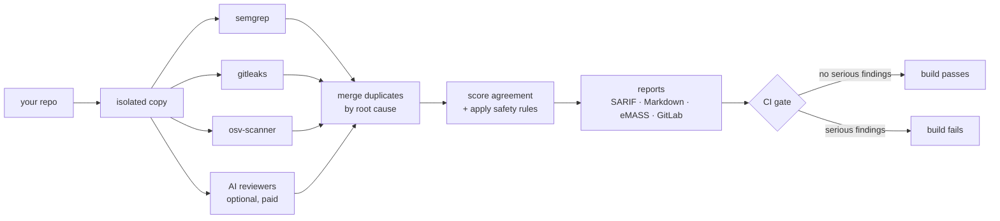

# security-council

**Point it at a code repository and it finds security problems — using several
independent scanners at once, so you get more real issues and less noise.**

Security scanners have two classic problems: each one *misses* things the
others catch, and each one *cries wolf* (false positives) until people stop
reading the reports. security-council attacks both at once:

- it runs **multiple scanners in parallel** — fast traditional ones, and
  optionally AI reviewers that can follow logic across files;
- when several independent tools agree on the same problem, your confidence
  goes up — **agreement is measured and scored**;
- when a finding looks wrong, it can be challenged by an **AI
  cross-examination panel** and demoted — but by design it is **never
  silently deleted**, so a real bug can't be quietly buried.



New to any of these words? **[docs/concepts.md](docs/concepts.md)** explains
every term in plain language.

## See it work in five minutes

You need Python 3.11+ and Docker. This uses only the free local scanners —
**no API keys, no cost, and your code never leaves your machine**:

```bash
pip install git+https://github.com/Intellimetrics/security-council
security-council doctor
```

`doctor` tells you what's ready to run:

```text
security-council doctor
  docker         ready  /usr/bin/docker
  semgrep       ready       docker: semgrep/semgrep
  gitleaks      ready       docker: zricethezav/gitleaks:latest
  osv-scanner   ready       docker: ghcr.io/google/osv-scanner:latest
  ...
```

Then scan a project:

```bash
security-council scan .
```

```text
security-council scan 20260823_101557  (target /path/to/your/project)
  semgrep       ok        raw=3 normalized=3 2.41s
  gitleaks      ok        raw=2 normalized=2 0.17s
findings: 2 clusters  severity={'high': 1, 'medium': 1}
reports: .security-council/runs/20260823_101557  (summary.md, merged.sarif, findings.json, manifest.json)
exit 1
```

Notice `raw=5 → 2 clusters`: five raw alerts from two tools were recognized
as **two underlying problems**. Open `summary.md` in the run folder — it
reads like a report a human wrote:

```text
- **Gate:** FAIL — gating findings present (exit 1)

## At a glance
- **2 findings** (root-cause clusters): 1 high · 1 medium
- **Corroboration:** 1 confirmed by ≥2 independent vendor families · 1 only one eligible arm

| # | Severity | Title                          | Location          | Sources             |
| 1 | **HIGH** | AWS Access Key ID detected    | app/settings.py:2 | gitleaks, semgrep   |
| 2 | MEDIUM   | Formatted SQL query           | app/reports.py:9  | semgrep             |
```

Two independent tools found the same hardcoded credential — that agreement is
exactly what the report highlights. The exit code (`1` here, because a
high-severity finding is open) is what fails a CI build.

**➡ Full walkthrough, including how to handle a false positive:
[docs/tutorial.md](docs/tutorial.md)** — it uses the intentionally-vulnerable
practice repo that ships in this repository, so you can follow along safely.

## Use it in CI

```yaml
# GitHub Actions
permissions: {contents: read, security-events: write}
steps:
  - uses: actions/checkout@v4
  - uses: Intellimetrics/security-council@v0.1.0
    with: {fail-on-severity: high, gate-baseline: new}
```

| Platform | Guide | You get |
|---|---|---|
| GitHub | [docs/ci/github.md](docs/ci/github.md) | code-scanning alerts + PR annotations |
| Azure DevOps Server | [docs/ci/azure-devops.md](docs/ci/azure-devops.md) | SARIF results tab, file/line annotations, PR comment threads |
| GitLab | [docs/ci/gitlab.md](docs/ci/gitlab.md) | security widget (Ultimate) + inline MR annotations (all tiers) |

Already have a backlog of old findings? Two commands make an existing repo
adoptable — only *new* problems fail the build:
`security-council baseline set`, then scan with `--gate-baseline new`
([docs/triage.md](docs/triage.md)).

*Honesty note: all three CI integrations are schema-validated and tested
locally, but none has run on outside infrastructure yet — bug reports from
real pipelines are gold.*

## The AI reviewers (optional — costs money, sends code to vendors)

The free scanners match *patterns*. The optional AI arms *read the code* and
catch logic flaws — like an endpoint that returns another customer's data
(an IDOR) — that no pattern can describe. On this repo's own test fixture,
two different vendors' AI scanners independently found the seeded IDOR that
all the pattern scanners missed.

> **Before you enable them, know two things.** 1) They cost real money per
> scan (a small repo runs a few dollars; budget caps are built in). 2) **They
> send your source code to the AI vendor's servers** (Anthropic, OpenAI,
> Google — whichever CLIs you configure). If your code is sensitive or
> regulated, read **[docs/data-boundaries.md](docs/data-boundaries.md)**
> first — it lists exactly what leaves your machine for every arm. The
> default setup keeps everything local.

Setup, costs, and options for every arm: [docs/arms.md](docs/arms.md).

## Can I trust the automation? (the safety model)

The published research this project is built on found that naive AI triage
wrongly dismissed **22% of true vulnerabilities — over 50% for
cryptography-related ones**. So the rules here are structural, not
promises:

- Nothing is ever auto-deleted. A finding judged false is *demoted* (stops
  failing the build) but stays visible in every report.
- Auto-suppression is **off by default**, requires two explicit config flags,
  and dry-runs in "shadow mode" for five scans before it may act.
- Crypto and critical findings can **never** be auto-suppressed, at any
  setting.
- Every hidden finding must carry a verifiable record of who/what decided,
  and why — the code literally cannot construct one without it.
- Human suppressions expire (90 days) and cancel themselves if the code
  around the finding changes.

Plain-language version with code pointers:
[docs/safety-model.md](docs/safety-model.md).

## Documentation

| Read this… | …if you want to |
|---|---|
| [docs/tutorial.md](docs/tutorial.md) | **start here** — hands-on walkthrough on a safe practice repo |
| [docs/concepts.md](docs/concepts.md) | understand the words: arm, cluster, SARIF, disposition, baseline… |
| [docs/faq.md](docs/faq.md) | quick answers: cost, privacy, "why did my build fail?" |
| [docs/getting-started.md](docs/getting-started.md) | install details, config file reference, run-folder contents |
| [docs/arms.md](docs/arms.md) | every scanner/AI arm: cost, setup, options |
| [docs/data-boundaries.md](docs/data-boundaries.md) | know exactly what data leaves your machine (gov/regulated: start here) |
| [docs/triage.md](docs/triage.md) | operate it day to day: baselines, suppressing, recording ground truth |
| [docs/ci/](docs/ci/) | wire up GitHub / Azure DevOps / GitLab |
| [docs/compliance/emass.md](docs/compliance/emass.md) | DoD: export findings to eMASS |
| [docs/safety-model.md](docs/safety-model.md) · [docs/architecture.md](docs/architecture.md) | audit the design: invariants, guardrails, pipeline |
| [docs/mcp.md](docs/mcp.md) | let an AI assistant (e.g. Claude Code) drive scans via MCP |

## Status & the fine print

Working v1: 233 tests, live-verified end to end with every arm family. Not
yet done: score calibration (confidence numbers are labeled `prior`,
deliberately never called "calibrated"), OpenVEX/OSCAL exports, CI runs on
outside infrastructure. `tests/fixtures/seedrepo/` is **intentionally
vulnerable** (including fake AWS keys) — it's the practice target and test
corpus; see [SECURITY.md](SECURITY.md).

Built on [llm-council](https://github.com/Intellimetrics/llm-council).
License: source-available; evaluation use permitted — [LICENSE.md](LICENSE.md).
